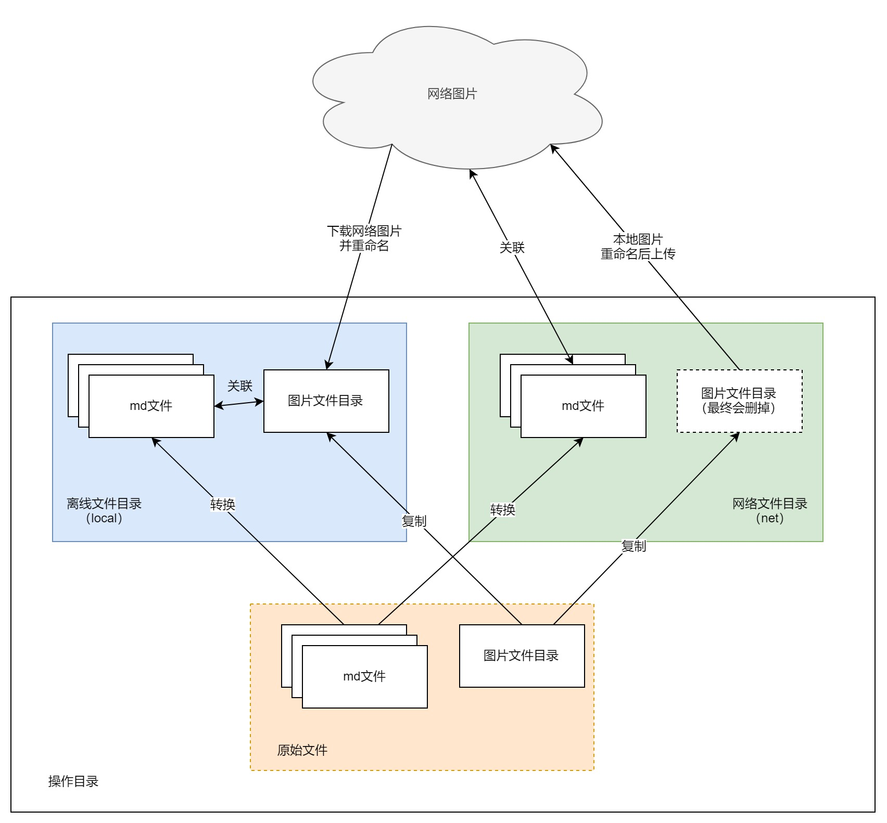
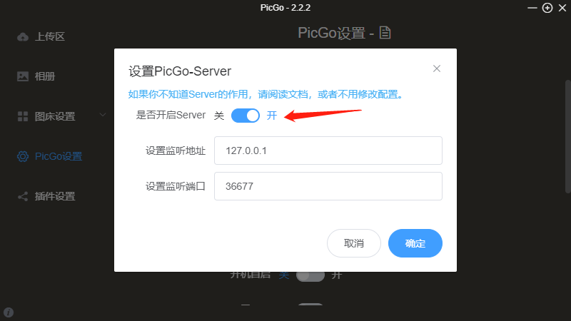
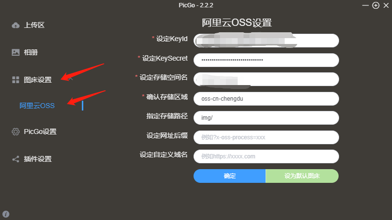

---

---

### 批量处理md文档图片自动上传与下载

#### 功能

将输入目录下的所有md文档中的本地图片上传到网络中，需安装和配置picgo图片上传软件，将网络中的图片下载到本地，支持离线阅读。生成的文档放到local和net目录中，原始文件及图片保存到backup目录中。

系统架构如下：

#### 配置说明

##### 软件配置

配置文件：config.json

配置示例：

  "srcDir":"D:\\\test",

  "imgDir":"img"

配置项说明：

- srcDir需要操作的目录，“.”表示当前目录

- imgDir文档引用的本地图片目录，通常为“img”

##### PicGo软件安装及配置

软件版本要求：

2.2.0及以上，支持http server功能（PicGo在`2.2.0`版本开始内置了一个小型的服务器，用于接收来自其他应用的HTTP请求来上传图片）

软件下载地址：

https://github.com/Molunerfinn/PicGo/releases

安装后的必要配置：

#### 软件运行

运行环境：python3.7及以上

依赖包：requests, psutil

以上配置完成之后，在软件目录下执行：

python main.py

#### 日志输出

运行日志将输出至软件目录的running.log文件中

#### 更新记录
- 2020-11-18：实现基本转换功能
- 2020-11-19：优化图片上传处理
- 2020-11-26：增加图片重命名功能
- 2020-12-02: 修改图片链接匹配规则，去掉baseUrl配置项
- 2020-12-06: 增加对PicGo程序的检测